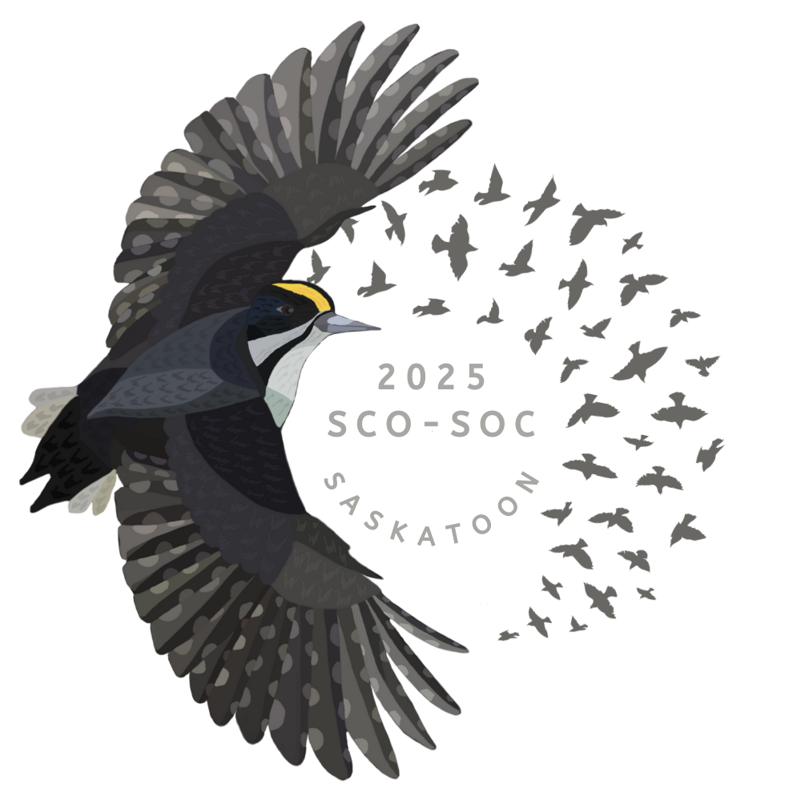

# Logo design for 2025 SCO-SOC conference

Visual design for the SCO-SOC conference. The logo will be used on websites, programs, and potentially T-shirts or other fundraising products. 

## Requested component
- A round logo
- Specify 2025 SCO-SOC in Saskatoon
- Components about the prairie avifauna or environment
- Black-backed Woodpecker

## Product

#### version 1 (2024 Oct.3)

Text outside          |  Text inside
:-------------------------:|:-------------------------:
  |  

## Schedule
- Sep.12: Online discussion with organizing committee
- Oct.8: Draft design for the logo for committee meeting

